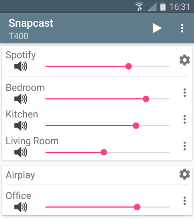

# Snapcast


**S**y**n**chronous **a**udio **p**layer

[](https://github.com/badaix/snapcast/actions/workflows/ci.yml)
[](https://github.com/badaix/snapcast/releases)
[](https://github.com/badaix/snapcast/releases)
[](https://www.paypal.me/badaix)

Snapcast is a multiroom client-server audio player, where all clients are time synchronized with the server to play perfectly synced audio. It's not a standalone player, but an extension that turns your existing audio player into a Sonos-like multiroom solution.  
Audio is captured by the server and routed to the connected clients. Several players can feed audio to the server in parallel and clients can be grouped to play the same audio stream.  
One of the most generic ways to use Snapcast is in conjunction with the music player daemon ([MPD](http://www.musicpd.org/)) or [Mopidy](https://www.mopidy.com/).


## How does it work

The Snapserver reads PCM chunks from configurable stream sources:

- **Named pipe**, e.g. `/tmp/snapfifo`
- **ALSA** to capture line-in, microphone, alsa-loop (to capture audio from other players)
- **TCP**
- **stdout** of a process
- Many more

The chunks are encoded and tagged with the local time. Supported codecs are:

- **PCM** lossless uncompressed
- **FLAC** lossless compressed [default]
- **Vorbis** lossy compression
- **Opus** lossy low-latency compression

The encoded chunks are sent via a TCP connection to the Snapclients.
Each client does continuous time synchronization with the server, so that the client is always aware of the local server time.
Every received chunk is first decoded and added to the client's chunk-buffer. Knowing the server's time, the chunk is played out using a system dependend low level audio API (e.g. ALSA) at the appropriate time. Time deviations are corrected by playing faster/slower, which is done by removing/duplicating single samples (a sample at 48kHz has a duration of ~0.02ms).

Typically the deviation is below 0.2ms.

For more information on the binary protocol, please see the [documentation](doc/binary_protocol.md).

## Installation

You can either install Snapcast from a prebuilt package (recommended for new users), or build and install snapcast from source.

### Install Linux packages (recommended for beginners)

Snapcast packages are available for several Linux distributions:

- [Debian](doc/install.md#debian)
- [OpenWrt](doc/install.md#openwrt)
- [Alpine Linux](doc/install.md#alpine-linux)
- [Archlinux](doc/install.md#archlinux)
- [Void Linux](doc/install.md#void-linux)

### Nightly builds

There are debian packages of automated builds for `armhf`, `arm64` and `amd64` in [Snapcast Actions - Package workflow](https://github.com/badaix/snapcast/actions/workflows/package.yml).
Download and extract the archive for your architecture and follow the [debian installation instructions](doc/install.md#debian).

### Install using Homebrew

On macOS and Linux, snapcast can be installed using [Homebrew](https://brew.sh):

```bash
brew install snapcast
```

### Installation from source

Please follow this [guide](doc/build.md) to build Snapcast for

- [Linux](doc/build.md#linux-native)
- [FreeBSD](doc/build.md#freebsd-native)
- [macOS](doc/build.md#macos-native)
- [Android](doc/build.md#android-cross-compile)
- [OpenWrt](doc/build.md#openwrtlede-cross-compile)
- [Buildroot](doc/build.md#buildroot-cross-compile)
- [Raspberry Pi](doc/build.md#raspberry-pi-cross-compile)
- [Windows](doc/build.md#windows-vcpkg)

## Configuration

After installation, Snapserver and Snapclient are started with the command line arguments that are configured in `/etc/default/snapserver` and `/etc/default/snapclient`.
Allowed options are listed in the man pages (`man snapserver`, `man snapclient`) or by invoking the snapserver or snapclient with the `-h` option.

### Server

The server configuration is done in `/etc/snapserver.conf`. Different audio sources can by configured in the `[stream]` section with a list of `source` options, e.g.:

```ini
[stream]
source = pipe:///tmp/snapfifo?name=Radio&sampleformat=48000:16:2&codec=flac
source = file:///home/user/Musik/Some%20wave%20file.wav?name=File
```

Available stream sources are:

- [pipe](doc/configuration.md#pipe): read audio from a named pipe
- [alsa](doc/configuration.md#alsa): read audio from an alsa device
- [librespot](doc/configuration.md#librespot): launches librespot and reads audio from stdout
- [airplay](doc/configuration.md#airplay): launches airplay and read audio from stdout
- [file](doc/configuration.md#file): read PCM audio from a file
- [process](doc/configuration.md#process): launches a process and reads audio from stdout
- [tcp](doc/configuration.md#tcp-server): receives audio from a TCP socket, can act as client or server
- [meta](doc/configuration.md#meta): read and mix audio from other stream sources

### Client

The client will use as audio backend the system's low level audio API to have the best possible control and most precise timing to achieve perfectly synced playback.

Available audio backends are configured using the `--player` command line parameter:

| Backend   | OS      | Description  | Parameters |
| --------- | ------- | ------------ | ---------- |
| alsa      | Linux   | ALSA | `buffer_time=<total buffer size [ms]>` (default 80, min 10)<br />`fragments=<number of buffers>` (default 4, min 2) |
| pulse     | Linux   | PulseAudio | `buffer_time=<buffer size [ms]>` (default 100, min 10)<br />`server=<PulseAudio server>` - default not-set: use the default server<br />`property=<key>=<value>` set PA property, can be used multiple times (default `media.role=music`)  |
| oboe      | Android | Oboe, using OpenSL ES on Android 4.1 and AAudio on 8.1 | |
| opensl    | Android | OpenSL ES | |
| coreaudio | macOS   | Core Audio | |
| wasapi    | Windows | Windows Audio Session API | |
| file      | All     | Write audio to file | `filename=<filename>` (`<filename>` = `stdout`, `stderr`, `null` or a filename)<br />`mode=[w|a]` (`w`: write (discarding the content), `a`: append (keeping the content) |

Parameters are appended to the player name, e.g. `--player alsa:buffer_time=100`. Use `--player <name>:?` to get a list of available options.  
For some audio backends you can configure the PCM device using the `-s` or `--soundcard` parameter, the device is chosen by index or name. Available PCM devices can be listed with `-l` or `--list`  
If you are running MPD and Shairport-sync into a soundcard that only supports 48000 sample rate, you can use `--sampleformat <arg>` and the snapclient will resample the audio from shairport-sync, for example, which is 44100 (i.e.  `--sampleformat 48000:16:*`)

## Test

You can test your installation by copying random data into the server's fifo file

    cat /dev/urandom > /tmp/snapfifo

All connected clients should play random noise now. You might raise the client's volume with "alsamixer".
It's also possible to let the server play a WAV file. Simply configure a `file` stream in `/etc/snapserver.conf`, and restart the server:

    [stream]
    source = file:///home/user/Musik/Some%20wave%20file.wav?name=test

When you are using a Raspberry Pi, you might have to change your audio output to the 3.5mm jack:

    #The last number is the audio output with 1 being the 3.5 jack, 2 being HDMI and 0 being auto.
    amixer cset numid=3 1

To setup WiFi on a Raspberry Pi, you can follow this [guide](https://www.raspberrypi.org/documentation/configuration/wireless/wireless-cli.md)

## Control

Snapcast can be controlled using a [JSON-RPC API](doc/json_rpc_api/control.md) over plain TCP, HTTP, or Websockets:

- Set client's volume
- Mute clients
- Rename clients
- Assign a client to a stream
- Manage groups
- ...

### WebApp

The server is shipped with [Snapweb](https://github.com/badaix/snapweb), this WebApp can be reached under `http://<snapserver host>:1780`.


### Android client

There is an Android client [snapdroid](https://github.com/badaix/snapdroid) available in [Releases](https://github.com/badaix/snapdroid/releases/latest) and on [Google Play](https://play.google.com/store/apps/details?id=de.badaix.snapcast)



### Contributions

There is also an unofficial WebApp from @atoomic [atoomic/snapcast-volume-ui](https://github.com/atoomic/snapcast-volume-ui).
This app lists all clients connected to a server and allows you to control individually the volume of each client.
Once installed, you can use any mobile device, laptop, desktop, or browser.

There is also an [unofficial FHEM module](https://forum.fhem.de/index.php/topic,62389.0.html) from @unimatrix27 which integrates a Snapcast controller into the [FHEM](https://fhem.de/fhem.html) home automation system.

There is a [snapcast component for Home Assistant](https://home-assistant.io/components/media_player.snapcast/) which integrates a Snapcast controller in to the [Home Assistant](https://home-assistant.io/) home automation system and a [snapcast python plugin for Domoticz](https://github.com/akamming/domoticz-snapcast) to integrate a Snapcast controller into the [Domoticz](https://domoticz.com/) home automation system.

For a web interface in Python, see [snapcastr](https://github.com/xkonni/snapcastr), based on [python-snapcast](https://github.com/happyleavesaoc/python-snapcast). This interface controls client volume and assigns streams to groups.

Another web interface running on any device is [snapcast-websockets-ui](https://github.com/derglaus/snapcast-websockets-ui), running entirely in the browser, which needs [websockify](https://github.com/novnc/websockify). No configuration needed; features almost all functions; still needs some tuning for the optics.

A web interface called [HydraPlay](https://github.com/mariolukas/HydraPlay) integrates Snapcast and multiple Mopidy instances. It is JavaScript based and uses Angular 7. A Snapcast web socket proxy server is needed to connect Snapcast to HydraPlay over web sockets.

For Windows, there's [Snap.Net](https://github.com/stijnvdb88/snap.net), a control client and player. It runs in the tray and lets you adjust client volumes with just a few clicks. The player simplifies setting up snapclient to play your music through multiple Windows sound devices simultaneously: pc speakers, hdmi audio, any usb audio devices you may have, etc. Snap.Net also runs on Android, and has limited support for iOS.

## Setup of audio players/server

Snapcast can be used with a number of different audio players and servers, and so it can be integrated into your favorite audio-player solution and make it synced-multiroom capable.
The only requirement is that the player's audio can be redirected into the Snapserver's fifo `/tmp/snapfifo`. In the following configuration hints for [MPD](http://www.musicpd.org/) and [Mopidy](https://www.mopidy.com/) are given, which are base of other audio player solutions, like [Volumio](https://volumio.org/) or [RuneAudio](http://www.runeaudio.com/) (both MPD) or [Pi MusicBox](http://www.pimusicbox.com/) (Mopidy).

The goal is to build the following chain:

    audio player software -> snapfifo -> snapserver -> network -> snapclient -> alsa

This [guide](doc/player_setup.md) shows how to configure different players/audio sources to redirect their audio signal into the Snapserver's fifo:

- [MPD](doc/player_setup.md#mpd)
- [Mopidy](doc/player_setup.md#mopidy)
- [FFmpeg](doc/player_setup.md#ffmpeg)
- [mpv](doc/player_setup.md#mpv)
- [MPlayer](doc/player_setup.md#mplayer)
- [Alsa](doc/player_setup.md#alsa)
- [PulseAudio](doc/player_setup.md#pulseaudio)
- [AirPlay](doc/player_setup.md#airplay)
- [Spotify](doc/player_setup.md#spotify)
- [Process](doc/player_setup.md#process)
- [Line-in](doc/player_setup.md#line-in)
- [VLC](doc/player_setup.md#vlc)

## Roadmap

Unordered list of features that should make it into the v1.0

- [X] **Remote control** JSON-RPC API to change client latency, volume, zone,...
- [X] **Android client** JSON-RPC client and Snapclient
- [X] **Streams** Support multiple streams
- [X] **Debian packages** prebuild deb packages
- [X] **Endian** independent code
- [X] **OpenWrt** port Snapclient to OpenWrt
- [X] **Hi-Res audio** support (like 96kHz 24bit)
- [X] **Groups** support multiple Groups of clients ("Zones")
- [X] **Ports** Snapclient for Windows, Mac OS X,...
- [ ] **JSON-RPC** Possibility to add, remove, rename streams
- [ ] **Protocol specification** Snapcast binary streaming protocol, JSON-RPC protocol
